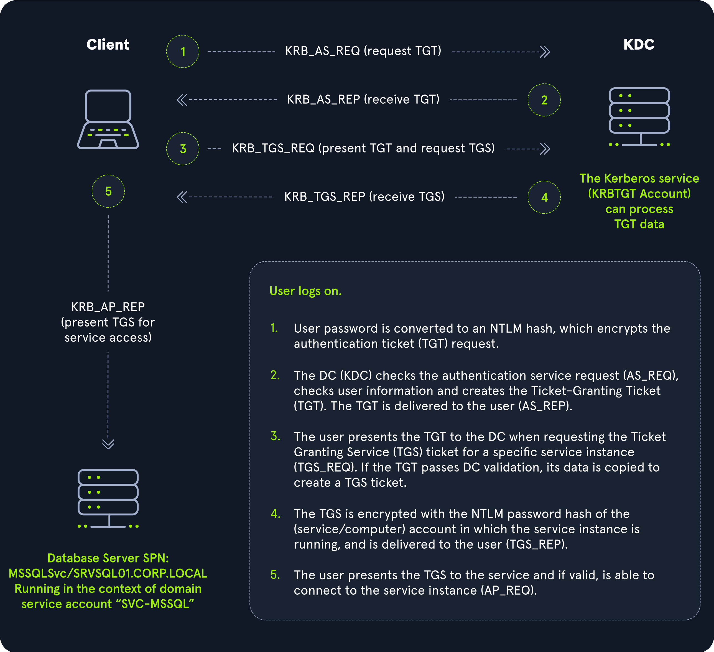

# Techtalk - Responder - AD Authentication Protocols

## Menu

- NTLM vs Kerberos ?
- What is responder ? 
- LLMNR / NBT-NS poisoning 
- SMB Relay
- Mitigation
- Demo

## NTLM vs Kerberos 

### How NTLM works ?

- NTLM is an older authentication protocol used in Windows environments. 
- It was the default protocol before the introduction of Kerberos in Windows 2000.
- NTLM uses a challenge-response mechanism where the user's password is hashed, and this hash is sent over the network during authentication.
- The server sends a challenge, and the client responds with a hashed value that proves it knows the password, without actually sending the password itself.
- The user's hashed passwords are stored in the `NTDS.DIT` database file on a Domain Controller so the server can verify if the hash sent by the client match the password in the database.
- If it does, the client is authenticated.

 

### How Kerberos works ?

- Kerberos is a secure authenticaiton protocol that is widely used in network environments, especially within Windows domains.
- It relies on a trusted third party known as the `Key Distribution Center (KDC)` to manage authentication process.
- When a user logs into their computer, Kerberos performs `mutual authentication`, meaning both the user and the server verify each other's identity.
- Instead of transmitting user passwords over the network, Kerberos uses a stateless system based on `encrypted tickets`.
- In an AD environment, Domain Controllers include a `Kerberos KDC`, which is responsible for issuing these tickets.

 

### Why is Kerberos a prefered option ? 

| Kerberos   | NTLM    |
|--------------- | --------------- |
| - Kerberos use tickets instead of password hashes. These tickets are valid for a limited period of time. This reduces the risk of replay attack.  | - NTLM relies on password hashes for authentication. Those passwords hashes are sent across the network as part of a challenge-response process. If an attacker captures this hash, they can reuse it to authenticate as the user without needing the actual password (Pass the hash).  |
| - Kerberos provides mutual authentication, both the user and the service they are trying to access verify each other's identity. This ensures that the user is communicating with a legitimate service and not an imposter.   | - NTLM primarily focuses on authenticating the user to the service, with no built-in mechanism to verify the service's authenticity. This leaves it vulnerable to `Man-In-The-Middle` attacks.   |
| - Kerberos supports Single-Sign-On, allowing users to authenticate once and then access multiple services without needing to re-enter their credentials. This reduces the attack surface, as credentials are not repeatedly transmitted across the network.   | - NTLM does not inherently support SSO in the same way, often requiring multiple authentications, which increases the chances of interception and compromise.   |


## Introduction to Responder

Responder is a powerful tool used for various network attacks and analysis, such as:

- LLMNR (Link-Local Multicast Name Resolution) Poisoning
- NBT-NS (NetBIOS Name Service) Poisoning
- mDNS (Multicast DNS) Poisoning
- WPAD (Web Proxy Auto-Discovery Protocol) Spoofing

Additionally, Responder has useful "Analyze" modes for network reconnaissance.

### Analyze Modes in Responder

#### Browser Mode:

- Purpose: Inspects browse service messages.
- Funtion: Maps IP addresses to NetBIOS names.

#### LANMAN Mode:

- Purpose: Passively maps network devices.
- Function: Identifies domain controllers, servers and workstations joined to a domain using the Browser protocol.

#### LLMNR, NBTNS, MDNS Modes:

- Purpose: Inspects broadcast and multicast name resolution requests.
- Function: Analyzes name resolution traffic for various protocols.

#### Using Analyze Modes

```
responder --interface "eth0" --analyze

# OR 

responder -I "eth0" -A 
```

When using analyze modes, Responder provides valuable information such as:

- Domain Controllers: Identifies domain controllers on the network.
- SQL Servers: Detects SQL servers.
- Workstations: Lists workstations on the network.
- Fully Qualified Domain Names (FQDN): Shows FQDNs of network devices.
- Windows Versions: Indicates the versions of Windows in use.
- Protocol States: Displays the enabled or disabled state of protocols like LLMNR, NBTNS, MDNS, LANMAN and BROWSER.

## LLMNR / NBT-NS poisoning

- Given that LLMNR is a name resolution protocol that works on the Local Area Network (LAN), this attack method cannot be performed from a different subnet.
- The attacker would have to compromise a host on the LAN and upload tools, or plant a device on the LAN.

### What is LLMNR 

- A protocol that resolves hostnames on the same LAN when DNS is not available.


1. A host queries the local DNS server for a particular hostname
2. The DNS server responds `NXDOMAIN` meaning the hostname was not found
3. The host then sends a broadcast on the link-local multicast address to ask its fellow LAN members if they know

### What is the Flaw ? 

- LLMNR is a layer 2 broadcast, all hosts on the LAN are going to receive it. 
- That means that an attacker with access to the LAN is able to intercept this broadcast and reply to the broadcast with a spoofed addresss.

### How is this Exploited ? 

#### Capturing the NetNTLMv2 Hashes

Acting as a Man-in-the-Middle:

 

- LLMNR Broadcast: Responder listens for LLMNR broadcasts on the local area network (LAN).
- Spoofing Hostnames: It spoofs the IP addresses of invalid hostnames to trick clients into connecting to it.
- False SMB Server: Responder hosts a fake SMB server. When clients connect to this fake server, they reveal their NetNTLMv2 hashes.

#### Relaying NetNTLMv2 Hashes 

Coupling with ntlmrelayx:

- Tool Integration: Combine Responder with ntlmrelayx to relay captured hashes across the network.
- Disable False Servers: Ensure that ntlmrelayx is used to host false servers and disable these servers in Responder’s configuration.
- Spoofing and Relaying:
    - Responder spoofs the IP address for the invalid hostname.
    - When the client connects to the fake server, ntlmrelayx captures the NetNTLMv2 hashes and attempts to use these hashes to access other servers or shares on the network.

#### Configuration and Usage

Various Responder modules can be enabled/disabled in the configuration file, generally located in `/etc/responder/Responder.conf`.
On Exegol, it is usually located in `/opt/tools/Responder/Responder.conf`.
If you can not find it on your machine use the find command `sudo find / -name "Responder.conf" 2>/dev/null`.

```
# Using -v with responder allows for continuous display of hashes
# Where the default behavior is to only display a captured hash once
sudo responder -I <interface-name> -dvw
```

## Mitigation Strategies 

### Prefer using Kerberos authentication

#### Why ?

- Kerberos provides stronger security compared to NTLM by using ecrypted tickets and supporting mutual authentication.

#### How ?

- Ensure that Kerberos is enabled and configured as the primary authentication protocol in your network environment.
- Regularly review and update Kerberos policies to maintain security.

### Disable LLMNR and NetBIOS protocols on the Network

#### Why ?

- LLMNR and NetBIOs are vulnerable to poisoning attacks that can be exploited to capture authentication credentials.

#### How ?

- LLMNR: Disable LLMNR on all network devices through Group Policy or local settings.
- NetBIOS: Disable NetBIOS over TCP/IP on Windows systems by configuring the TCP/IP properties in network settings.
- Verify: Use network scanning tools to ensure these protocols are not active on your network.

### Enable and require SMB signing on all Windows hosts

#### Why ?

- SMB signings helps protect against main-in-the-middle attacks by ensuring that SMB communications are authentic and have not been tampered with.

#### How ? 

- Group Policy: Configure Group Policy settings to require SMB signing. This can be done under `Computer Configuration => Policies => Administrative Templates => Network => Lanman Workstation` and `Lanman Server`.
- Registry: Alternatively, SMB signing can be enforced via registry settings. Ensure the `RequireSecuritySignature` and `EnableSecuritySignature` regristry keys are set to `1`.

### Additional Mitigations

- Regularly update and patch systems
- Implement network segmentation
- Use strong authentication methods, implement MFA wherever possible
- Monitor and audit network traffic
- Educate users 

## Demo

The demo is based on the Responder machine available on Hackthebox : https://app.hackthebox.com/starting-point 

- Connect to the VPN, now we are on the same LAN as the target machine
- Add `unika.htb` in the `/etc/hosts` since the server is a `name based virtual host`
- Show the responder configuration file in `/opt/tools/Responder/Responder.conf`
- Launch responder `responder -I tun0 -dvw`
- Trigger a DNS error via an LFI in the target's website by searching for a share that does not exist (can show the existence of the lfi by visiting http://unika.htb/index?page=../../../../../../../../windows/system32/drivers/etc/hosts)
- Receive the user credentials, crack it with hashcat `hashcat -m 5600 -a 0 hash.txt /usr/share/wordlist/rockyou.txt`
- Gain a shell with evil-winrm and its command: `evil-winrm -i <our-ip-address> -u <username> -p <password>`

## Sources and resources

- The hacker recipe: https://www.thehacker.recipes/
- Benheater notes: https://notes.benheater.com/books/active-directory/
- Hackethebox academy AD modules: https://academy.hackthebox.com/module/details/74/ & https://academy.hackthebox.com/module/details/143/
- Responder on Github: https://github.com/lgandx/Responder
- French and English article about NBTNS & LLMNR poisoning: http://remivernier.com/index.php/2018/08/26/protocoles-nbt-ns-llmnr-et-exploitation-des-failles/ & https://www.sternsecurity.com/blog/local-network-attacks-llmnr-and-nbt-ns-poisoning/
- If you want to learn more about the network protocols mentionned:
    - LLMNR: https://en.wikipedia.org/wiki/Link-Local_Multicast_Name_Resolution
    - NBTNS: https://en.wikipedia.org/wiki/NetBIOS_over_TCP/IP 
    - MDNS: https://en.wikipedia.org/wiki/Multicast_DNS 
    - LANMAN: https://en.wikipedia.org/wiki/LAN_Manager 
    - BROWSER: https://en.wikipedia.org/wiki/Browser_service
- French Openclassrooms lesson: https://openclassrooms.com/fr/courses/7723396-assurez-la-securite-de-votre-active-directory-et-de-vos-domaines-windows
- PetiPotam on Github: used for NTLM relays
